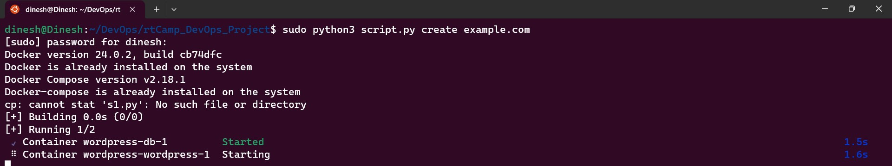

# rtCamp_DevOps_Project
This repo will contain the scripts and other md for the project given by rtCamp


### Index
- [Task](#Task)
- [How to run the script](#How-to-run-the-script)
- [pre-requisite](#pre-requisite)
- [Step 1: check if docker and docker compose files are present](#Step-1:-check-if-docker-and-docker-compose-files-are-present)
- [Step 2: to create the WordPress site using latest version of WordPress, using LEMP stack by writing docker-compose file](#Step-2:-to-create-the-WordPress-site-using-latest-version-of-WordPress-using-LEMP-stack-by-writing-docker-compose-file)
- [Step 3: Adding a method create, that will trigger the build and start the containers for the wordpress site](#Step-3:-Adding-a-method-create-that-will-trigger-the-build-and-start-the-containers-for-the-wordpress-site)
- [Step 4: option to Enable, Disable and Delete the site](#Step-4:-option-to-Enable-Disable-and-Delete-the-site)
- [Step 5: parsing the arguments from the terminal](#Step-5:-parsing-the-arguments-from-the-terminal)
- [Extras and room for improvements](#Extras-and-room-for-improvements)


# Task

To create a command-line script, preferably in Bash, PHP, Node, or Python to perform the following tasks https://rtcamp.com/assignments/devops-engineer/:

<details>
<summary>tasks and guidelines</summary>
    1. Check if `docker` and `docker-compose` is installed on the system. If not present, install the missing packages.<br>
    2. The script should be able to create a WordPress site using the latest WordPress Version. Please provide a way for the user to provide the site name as a command-line argument.<br>
    3. It must be a LEMP stack running inside containers (Docker) and a docker-compose file is a must.<br>
    4. Create a `/etc/hosts` entry for *example.com* pointing to localhost. Here we are assuming the user has provided *example.com* as the site name.<br>
    5. Prompt the user to open *example.com* in a browser if all goes well and the site is up and healthy.<br>
    6. Add another subcommand to enable/disable the site (stopping/starting the containers)<br>
    7. Add one more subcommand to delete the site (deleting containers and local files).<br>
    
    Submission Guidelines<br>
    
    - CLIG Guidelines ➞ Please follow [Command Line Interface Guidelines](https://clig.dev/).
    - Source Code Hosting ➞ You must use GitHub *(recommended)* or GitLab for source code hosting.
    - Readme.md ➞ Your must have a very well written readme describing how to install your script, how to run different command & sub-commands in markdown format.
</details>


## How to run the script

1. Fork the repository to your remote repository using the fork button
2. open the terminal and clone repository, this will create a folder named `rtCamp_DevOps_Project` automatically or have your preferred name.
3. `cd` to the directory and run the script

the format of the script as follows:

`sudo python3 scriptname <option> <site_name>`



```bash
#cloning
git clone https://github.com/Dineshkumar-S99/rtCamp_DevOps_Project.git

cd rtCamp_DevOps_Project

#to create wordpress site
sudo python3 script.py create "SiteNameWeWant"

#to create a wordpress site named example.com
sudo python3 script.py create example.com

#to disable or stop 
sudo python3 script.py disable example.com

#to enable or start
sudo python3 script.py enable example.com

#to delete the wordpress site and everything assosiated with it
#like deleting the container,db and sitename we assigned
sudo python3 script.py delete example.com

```

1. now we can access the site by using following methods, our site listens to port 8080 as we exposed to to that port.
    
    
    site_name we specified eg: example.com:8080
    
    
    
    use [localhost:8080](http://localhost:8080) 
    
    
    
     
    
    directly use address 127.0.0.1:8080  
    
    
    

## pre-requisite

1. preferable have a Linux based OS.

and that’s it we use terminal to execute the tasks and most Linux based OS comes with Python, so we are ready to write and execute the code.

### Step 1: check if docker and docker compose files are present.

first of all, to check if the dependencies are present or not, we have to interact with the current OS we are running on, so we import the required modules to interact with OS and other modules to interact using arguments in the terminal. 

```python
import os
import argparse
import webbrowser
import subprocess
```

> **`os`** module - help us to interact with the OS of the system and perform OS operations like listing directories, manipulating paths, and executing system commands.
> 

> **`argparse`** module - helps us to this will help us to create a command line interface for our script. so that we can run our script from the command line and also can use arguments to perform different actions in our script.
> 

> **`webbrowser`** module - helps us to view our deployed website from the web browser by opening it automatically.
> 

> **`subprocess`** module - help us to pipe the output/error codes to execute a new program based on the previous codes.
> 

```python
**class** **Check_Docker_and_DockerCompose**:
    def __init__(self):
        self.docker="docker"
        self.docker_compose="docker-compose"

    def **ispresent**(self):
        if os.system("docker --version") == 0:
            print("Docker is already installed on the system")
        else:
            print("Docker is not installed on the system")
            #install docker
            os.system("curl -fsSL https://get.docker.com -o get-docker.sh")
            os.system("sh get-docker.sh")
            print("Docker is installed on the system")
            os.remove("get-docker.sh")

    #check if docker-compose is installed or not
        if os.system("docker-compose --version") == 0:
            print("Docker-compose is already installed on the system")
        else:
            print("Docker-compose is not installed on the system")
            #install docker-compose
            os.system("sudo apt install docker-compose")
            print("Docker-compose is installed on the system")
```


### Step 2: to create the WordPress site using latest version of WordPress, using LEMP stack by writing docker-compose file

1. creating a class to create the wordpress site and initializing the objects
2. create a `docker-compose.yml` file and add the script to include the latest images for the LEMP stack. LEMP→ Linux, Nginx, MySQL and Php.

```python
**class create_WordPress_site:**
    def __init__(self,site_name):
        self.siteName = site_name
        os.system("mkdir wordpress")  #creates a directory/folder named wordpress
        os.system("cp -r s1.py wordpress/")
        os.chdir("wordpress") #change the directory to wordpress
        os.system("touch **docker-compose.yml**") #touch will create the compose file
        f = open("docker-compose.yml", "w")  #now we open the compose file to edit (wite mode) and have it in memory using a variable so it's easy to write
    #compose file
        f.write("version: '3'\n")  #using compose version 3
        f.write("services:\n") #services are nothing but all the container services we gonna run
        f.write("  db:\n") #name for database
        f.write("    image: mysql:5.7\n")  #using Mysql image with tag 5.7
        f.write("    restart: always\n")
        f.write("    environment:\n")  # all the environment variables like the root password, name for DB, user and Password, to know more visit hub.docker.com
        f.write("      MYSQL_RANDOM_ROOT_PASSWORD: 1\n") 
        f.write("      MYSQL_DATABASE: {self.site_name}_db\n")#we take value from the variable so it can be changed as per requirements
        f.write("      MYSQL_USER: {self.site_name}_user\n")
        f.write("      MYSQL_PASSWORD: wordpress\n")
        f.write("    volumes:\n")  # volumes are using like a mounting device to store the data for further or future use case
        f.write("      - db_data:/var/lib/mysql\n") # mounting db_data volume to /var/lib/mysql
        f.write("  wordpress:\n") #name for wordpress container
        f.write("    depends_on:\n")
        f.write("      - db\n") #we give depends on so that the db will get 
        f.write("    image: wordpress:latest\n") #lastest image of Wordpress
        f.write("    restart: always\n")
        f.write("    ports:\n")
        f.write("      - '8080:80'\n") #exposing to port 8080 of host machine to connect with the port 80 of the container
        f.write("    environment:\n")
        f.write("      WORDPRESS_DB_HOST: db:3306\n")
        f.write("      WORDPRESS_DB_USER: {self.site_name}_user\n")#same as above, note: we have same values as above because that's how we can connect
        f.write("      WORDPRESS_DB_PASSWORD: wordpress\n")
        f.write("      WORDPRESS_DB_NAME: {self.site_name}_db\n")
        f.write("    volumes:\n")
        f.write("      - wordpress:/var/www/html\n")#mounting the volume wordpress to /var/www/html
        f.write("volumes:\n") #defining all the volumes that we want to mount
        f.write("  db_data:\n")
        f.write("  wordpress:\n")
    #close the file docker-compose.yml
        f.close()
    #create a file named .env

        os.system("touch .env") #we create a .env file to store all the environment files so it can be used for future cases
    #open the file .env
        f = open(".env", "w")
    #write the following code in the file .env
        f.write("MYSQL_ROOT_PASSWORD=1\n")
        f.write("MYSQL_DATABASE=wordpress\n")
        f.write("MYSQL_USER=wordpress\n")
        f.write("MYSQL_PASSWORD=wordpress\n")
    #close the file .env
        f.close() #we should close else this file will stay in the memory
```

### Step 3: Adding a method create, that will trigger the build and start the containers for the wordpress site

This method will be included in the class and it takes all the class attributes and work on it.

```python
def **create**(self):
        subprocess.run(["docker-compose", "up", "-d"])  #this will run the command "docker-compose up -d"
        with open("/etc/hosts","a") as f:
            f.write("\n127.0.0.1 {}".format(self.siteName)) #opens the /etc/hosts file and add the sitename we given to the localhost ip add
#it's just like IP add masking can use this name instead of the 127.0.0.1

        print("WordPress site is now running, access it with http://{}:8080".format(self.siteName)) #prompt us to view the site with link
        webbrowser.open("https://{}/8080") #opens the site in the default webbrowser we added
```

`docker-compose up -d` → this will construct containers if there are no containers and start the containers in detached mode, so the logs don’t clog up our terminal.


### Step 4: option to Enable, Disable and Delete the site

```python
**class EnableDisable_or_DeleteSite:**
    def __init__(self,site_name):
        self.siteName=site_name

    def **enable**(self):
        os.chdir("wordpress")
        subprocess.run(["docker-compose", "start"]) #this command will start the container
        print("WordPress site is now running, access it with http://{}:8080".format(self.siteName))

    def **disable**(self):
        os.chdir("wordpress") 
        subprocess.run(["docker-compose", "stop"]) #this command will stop the containers don't delete but stop

    def **delete**(self):
        os.chdir("wordpress")
        subprocess.run(["docker-compose", "down"]) #this commands= will stop and delete all the containers
        os.system("cd ..")
        os.system("sudo rm -rf wordpress/") #remove the folder we have created
        os.system("sudo sed -i /{}/d /etc/hosts".format(self.siteName)) #this will remove the name we have mapped in the /etc/hosts file
```


### Step 5: parsing the arguments from the terminal

we use argparse module to interact with the script in the terminal and also to provide user 

```python
def **main**():
    parser = argparse.ArgumentParser(description='Create, enable, disable, or delete a WordPress site using Docker') #if the basic arguments have't passed this will show the whole description.
    subparsers = parser.add_subparsers(dest='command') #this will help us to add the arguments as commands

    # Command: for create argument, this will will take in two parser, one is site_name and create
    create_parser = subparsers.add_parser('create', help='Create a new WordPress site') #object of subparser 
    create_parser.add_argument('site_name', help='Name of the site') #adding the site_name vlaue from the terminal get added as method attribute to the subparser
    
    # Command: for enable argument, rest explanations are same as create_parser instead create it's enable
    enable_parser = subparsers.add_parser('enable', help='Enable a WordPress site')
    enable_parser.add_argument('site_name', help='Name of the site')
    
    # Command: for disable argument, rest explanations are same as create_parser instead create it's disable
    disable_parser = subparsers.add_parser('disable', help='Disable a WordPress site')
    disable_parser.add_argument('site_name', help='Name of the site')
    
    # Command: for delete argument, rest explanations are same as create_parser instead create it's delete
    delete_parser = subparsers.add_parser('delete', help='Delete an existing WordPress site')
    delete_parser.add_argument('site_name', help='Name of the site')

    args = parser.parse_args() #creating an object with parser with which we can access all the arguments we have parsed from the terminal using parse method
    
		if args.command == 'create': #whatever that we added in subparsers commes in command as we have sepcified in the second line as command, so we compare the command from subparsers equal to create or not and execute further.
      Check_Docker_and_DockerCompose().ispresent() #to create a wordpress site, we first check is docker and docker compose present, if not install
      create_WordPress_site(args.site_name).create() #calling create method from create_WordPress_site class and create the compose file and run them to create containers and wordpress site inside the container

    elif args.command == 'enable': #same as create but we use this if we already have a image/container but we are just starting them , than creating from scratch.
        EnableDisable_or_DeleteSite(args.site_name).enable() #calling enable method from EnableDisable_or_DeleteSite class

    elif args.command == 'disable': #same as enable but here to disbale the containers, 
        EnableDisable_or_DeleteSite(args.site_name).disable() #clling disable method from EnableDisable_or_DeleteSite class

    elif args.command == 'delete': #same as other, but to delte the created or existing containers and deleting the site name from /etc/hosts file
        EnableDisable_or_DeleteSite(args.site_name).delete() #calling delete method from EnableDisable_or_DeleteSite class

    else:
        parser.print_help() #if something else the user enter, this will show all the options and how the arguments should be passed.
```


and at last we call the main function

```python
if __name__=="__main__":  #this condition will make sure that main function runs only when this file is ran directly, if imported it won't run directly without calling.
    main() #calling the main function.
```

### Extras and room for improvements:

we can still able to reduce the number of lines of code, if we want yes there is room for improvement and optimization, 

1. can execute this in cloud vm eg; am using Azure vm
    1. create a vm, and dowmload the key.pem file
    2. ssh using key and public ip, format looks like `ssh -i username@ip key.pm`
    3. and continue the same process from step1 to step5.
    
    
    

1. could change the `Check_Docker_and_DockerCompose` class where we using if and else twice.
2. instead using write these many times, can use some other methods.

 

**—END—**

Extra stories, you could skip just some self remembrance journal on how this felt and went 

about situations where I got stuck in process and how I handled: 

1. argparse module was so new as am a fresher never heard about it before, so what i did i build small terminal projects where i can make it interact and understood how it works. still not a great percent but now I could handle where ever there’s need of argparse.
2. now it’s same from argparse module but i built them, it started only responding to create and not any other attributes, uf took so much coffee to debug but it was fun as it’s first time, it’s good to get hand’s dirty right!
3. there’s ample amount of time gone in mapping the site name to the [localhost](http://localhost) url i.e:127.0.0.1, though I know how to do it, I haven’t got the output by typing the site_name in browser. 
    
    came to know we could just clear the network cache and get it done.
    
4. wanted it to automatically open the site in my browser so searched some and found webbrowser module, which let us to open the site automatically in browser. note: don’t forget to add default browser for your OS, if you haven’t specified it won’t open. haha yeah from experience ;)